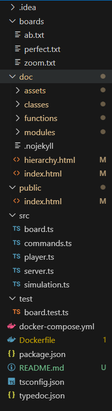
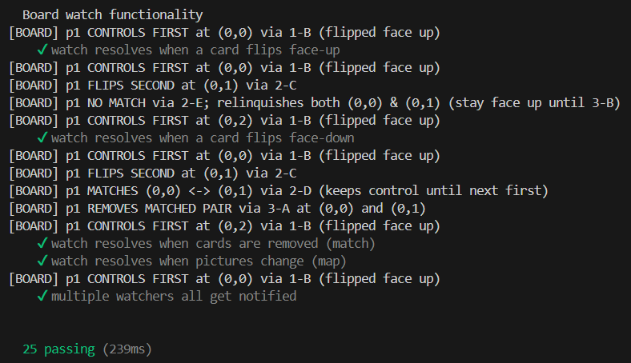
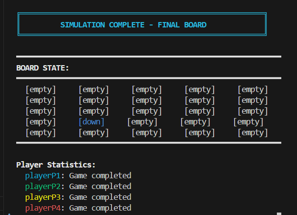
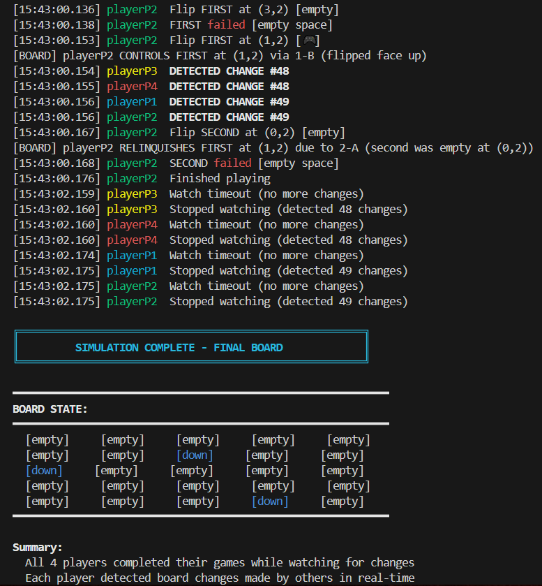

# LAB 3 PR: Memory Scramble

**Mitu Vladlen, FAF-232**

During this laboratory work I developed a networked multiplayer version of Memory Scramble, the game in which you turn over face-down cards and try to find matching pairs. My version has players turning over cards simultaneously, rather than taking turns.

## Contents of Directory

• I have multiple directories in the root. The boards directory contains game board configuration files (ab.txt, perfect.txt, zoom.txt) that define different card layouts. src contains the TypeScript source files including the core game logic (board.ts, player.ts, server.ts, commands.ts, simulation.ts). test contains unit tests (board.test.ts) for testing the game components. public contains web assets served to clients. doc contains documentation resources organized into subdirectories using TypeDoc.



## Running the project

We can run the project locally using the command:

```
npm start 8080 boards/perfect.txt
```

We can also run it using docker with the following command:

```
docker compose up
```

## Testing

I wrote tests for all rules and parsing of the board as well. Tests can be run with the following command:

```
npm run test
```

They all successfully run, as can be seen in the following picture:



## Simulation

I have both simple polling mode simulation with one watcher to state changes and a simulation with players that are only in watch mode. To run the basic polling simulation, we run:

```
npm run simulation
```




Every operation done by each player and every operation observed by board and watcher is logged to test if rules are applied correctly.

To start the simulation with only watchers, we run:

```
npm run simulation watch
```

And we see actions from players as well as logs that prove that other players detected that move as well.


